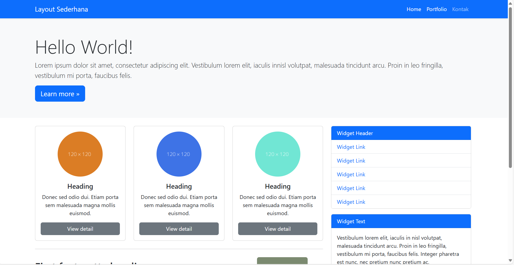
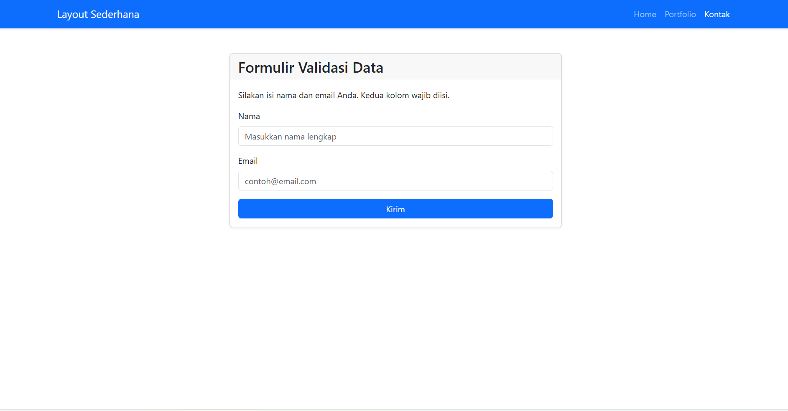
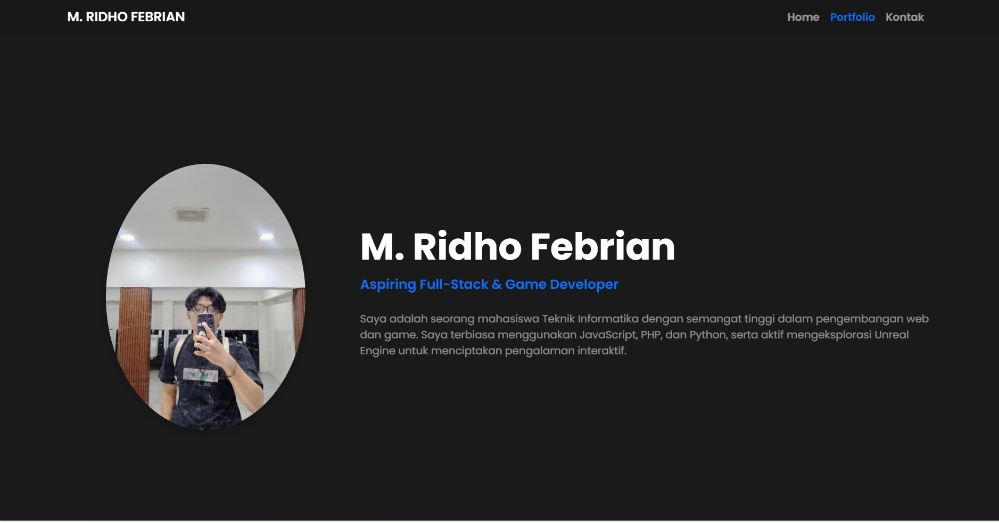

# Lab6Web
```markdown
Nama: M.Ridho Febrian
NIM: 312410500
Kelas: TI.24.A.5  
Mata Kuliah: Pemrograman Web  
Dosen Pengampu: Agung Nugroho, S.Kom., M.Kom  
Universitas: Pelita Bangsa  
Praktikum ke: 6
Struktur Folder Proyek
Berikut adalah struktur direktori final dari proyek ini.
```
---

### Praktikum 6: Implementasi CSS Framework Bootstrap
Selamat datang di repository untuk Praktikum 6 Pemrograman Web. Proyek ini berfokus pada penggunaan CSS Framework Bootstrap 5 untuk membangun dan menata ulang halaman web yang modern dan responsif.

Tujuan utama dari praktikum ini adalah untuk memahami konsep framework, beralih dari layout CSS manual (menggunakan float), dan memanfaatkan komponen siap pakai untuk mempercepat proses pengembangan.

### 1. Materi Praktikum: Pengenalan Komponen Bootstrap
Sebelum mengerjakan tugas utama, langkah pertama adalah memahami dan mencoba komponen-komponen inti dari Bootstrap.

**a. Setup & Container**

Untuk memulai, Bootstrap diintegrasikan ke dalam proyek menggunakan CDN (Content Delivery Network). Ini memungkinkan kita untuk menggunakan framework tanpa harus mengunduh file secara lokal. Konten kemudian dibungkus di dalam sebuah container untuk mengatur perataan dan lebar halaman.


`.container`: Memberikan lebar maksimum yang tetap (fixed-width) pada halaman.


`.container-fluid`: Memberikan lebar penuh (full-width) sebesar 100%.

**b. Grid System**

Fitur inti Bootstrap yang menggantikan  `float` manual adalah Sistem Grid. Sistem ini membagi halaman menjadi 12 kolom virtual, memungkinkan pembuatan layout yang kompleks dan responsif dengan mudah.


`.row`: Berfungsi sebagai pembungkus untuk kolom-kolom agar tetap sejajar.

`.col-{breakpoint}-{angka}``: Menentukan lebar kolom pada ukuran layar tertentu. Contohnya, `.col-md-8` berarti kolom akan memakai 8 dari 12 bagian di layar medium (laptop) ke atas, dan akan otomatis memenuhi layar (100%) di layar kecil (HP).
```HTML
<div class="container">
  <div class="row">
    <div class="col-md-8">
      </div>
    <div class="col-md-4">
      </div>
  </div>
</div>
```

**c. Komponen Utama**

Bootstrap menyediakan berbagai komponen siap pakai yang mempercepat pengembangan:


Navbar: Untuk membuat menu navigasi atas yang responsif dan otomatis menjadi menu "hamburger" di perangkat mobile.


Card: Sebuah kontainer konten yang fleksibel, ideal untuk menggantikan `.widget-box` atau `.box`dari praktikum sebelumnya.


Form: Dengan kelas seperti `.form-control` dan `.form-label`, elemen form dapat ditata agar terlihat rapi dan konsisten dengan mudah.


Button: Menyediakan berbagai gaya tombol hanya dengan menambahkan kelas seperti `.btn` dan `.btn-primary`.


---

## 2. Tugas Praktikum dan Hasil Akhir ##

Praktikum ini terdiri dari tiga tugas utama yang dikerjakan secara berurutan.

## Tugas 1: Refactor Layout Praktikum 4 (`index.html`) ##

Tugas pertama adalah mengambil layout dari Praktikum 4 yang dibuat dengan CSS manual dan membangunnya kembali menggunakan Bootstrap Grid System.


*Implementasi*: Navigasi diubah menggunakan komponen `<nav>` Bootstrap. Layout utama diatur dengan `.row`, `.col-md-8` (untuk konten utama), dan `.col-md-4` (untuk sidebar). Komponen `.card`digunakan untuk menggantikan semua `.widget-box` dan `.box` dari kode lama.


Hasil: Halaman `index.html` kini sepenuhnya responsif tanpa menggunakan properti `float` atau `clear` manual



---

### Tugas 2: Refactor Form Praktikum 5 (`contact.html`) ### 

Tugas kedua adalah mengambil formulir dari Praktikum 5 dan menatanya ulang menggunakan kelas-kelas form dari Bootstrap.


Implementasi: Setiap elemen form diberi kelas yang sesuai, seperti `.form-label` untuk label dan `.form-control` untuk input, untuk mendapatkan tampilan yang modern dan bersih.

Hasil: Halaman `contact.html` kini menampilkan formulir yang rapi, terstruktur, dan konsisten secara visual.



---

### Tugas 3: Membuat Halaman Portfolio Baru (`portfolio.html`) ###

Tugas terakhir adalah membuat halaman portfolio sederhana dari nol menggunakan Bootstrap.


Implementasi: Halaman ini berisi sebuah Navbar, section "Tentang Saya" dengan layout 2 kolom (foto di kiri, deskripsi di kanan) , dan section "Portfolio Saya" dengan layout 3 kolom yang menampilkan proyek-proyek menggunakan komponen `.card`.


Hasil: Halaman `portfolio.html` menjadi sebuah halaman profil yang fungsional, responsif, dan menarik secara visual, siap untuk menampilkan proyek-proyek yang pernah dibuat.



---

## 3. Teknologi yang Digunakan ## 

1. HTML5

2. CSS3 (Untuk kustomisasi tambahan)

3. Bootstrap 5 (Framework utama)

4. JavaScript (Untuk fungsionalitas komponen Bootstrap)
